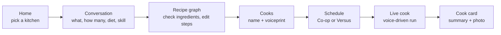
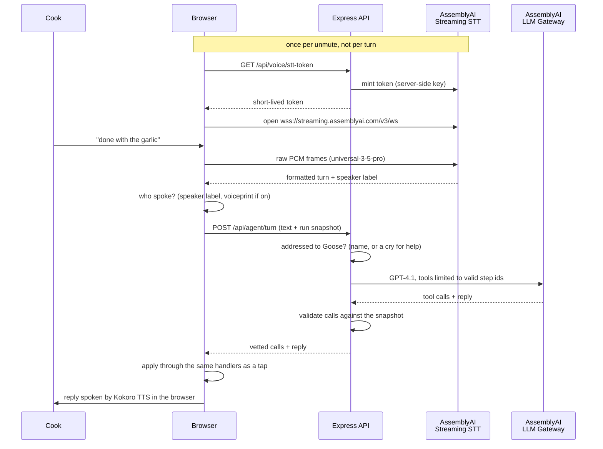

<h1 align="center">Goose! Goose! Cook!</h1>

<p align="center">
  
</p>

<p align="center">
  <b>A voice-run kitchen for two cooks and one very serious goose.</b><br>
  Tell Goose what you want for dinner. It drafts the recipe, splits the work, and calls the steps while you cook.
</p>

<p align="center">
  <a href="https://ziqing110.github.io/goose-goose-cook/">Live demo</a> ·
  <a href="docs/API_FLOW.md">API flow</a> ·
  <a href="docs/VOICE_COMMANDS.md">Voice commands</a> ·
  <a href="DEPLOY.md">Deploy</a>
</p>

---

## The pitch

Cooking a multi-dish dinner with someone else is a scheduling problem that
nobody treats as one. Two people, one stove, three dishes, and a rice cooker
that needs starting before anything else. Somebody ends up idle while the
other is juggling four pans.

Goose! Goose! Cook! treats a recipe as a **graph of steps** and your kitchen
as a set of **limited resources**. It works out the fastest plan for the
cooks and equipment you actually have, then runs that plan live, by voice.
And because cooking together should be fun, it can also turn dinner into a
match.

### Hands-free is the point, not a bonus

In a kitchen your hands are busy, wet, or covered in raw chicken. A recipe
app you have to tap is one you stop using the moment the wok gets hot. So
voice here is the main interface, not an add-on:

- **Every action works by voice.** Start, finish, claim, skip, undo, pause
  and "what's next" all have a spoken form. Buttons exist too, and both
  run the same code.
- **Just talk.** "I'm done with the onion" moves the plan on. Saying
  "Goose" first is optional, and chatter between cooks is left alone.
- **Built to be read from across the room.** The live screen is meant to be
  propped on the counter: big type, big targets, nothing that needs hover.
- **Goose talks back.** Replies are spoken, so nobody has to look up from
  the cutting board to hear what's next.

### Versus: dinner as a game

Pick *Co-op* and Goose hands each cook a balanced plan. Pick *Versus* and
the kitchen becomes a race:

- **A referee goose counts you in.** Three, two, one, go.
- **Steps are up for grabs.** Each cook starts with an opening hand, then
  claims steps from a shared pool by voice. If both call the same step,
  Goose rules on who spoke first. A dead heat goes to whoever is behind.
- **Points reward real cooking.** Harder steps score more. Starting the
  pot that everything else waits on earns a bonus, and so does finishing a
  step right on time. Chasing quick easy steps doesn't pay.
- **A keepsake at the end.** A cook card with your photo, the scoreboard,
  and a few deadpan lines from Goose about how it went.

### Under the hood

- **Real scheduling.** A branch-and-bound scheduler finds the shortest
  finish time against burners, woks, pots and people, then balances the
  work so one cook isn't doing three times as much. It re-plans live on
  every change.
- **An agent that can't go rogue.** The model only proposes actions. The
  server checks every one against the live run before the page applies it.

## How it works

A session walks through five stages. Every page listens to the same mic.



| Stage | What happens | Where it lives |
|---|---|---|
| Home | Pick or create a kitchen (its equipment is the resource limit), resume a run, see past cooks | `src/pages/HomePage.jsx` |
| Conversation | Goose asks four questions. Each spoken answer is read by an LLM into a structured slot | `ConversationPage.jsx`, `server/routes/understanding.js` |
| Recipe graph | An LLM drafts one step graph per dish, a second model reviews it, and shared prep (like mincing garlic) is merged across dishes. You uncheck what you're out of and see which steps it blocks | `InventoryPage.jsx`, `server/plan/` |
| Cooks | Each cook reads a line aloud. Optionally, a local service stores a voiceprint so Goose knows who spoke | `VoiceBindingPage.jsx`, `speaker-sidecar/` |
| Schedule | The scheduler builds a two-lane timeline with the critical path, or the Versus opening hand | `SchedulePage.jsx`, `src/utils/scheduleLayout.js` |
| Live cook | Cooks start, finish and hand off steps by voice or tap. Goose re-plans on every change | `LiveCookPage.jsx`, `src/pages/liveCook/`, `src/utils/liveCook.js`, `server/agent/` |
| Cook card | A frozen record of the run, downloadable as a PNG | `CookSummaryPage.jsx`, `src/utils/summaryCard.js` |

### One live-cook turn



If the agent is slow or unreachable, a local keyword grammar
(`src/utils/voiceCommands.js`) handles the command offline. If a question
needs a lookup ("can I use a shallot?"), the answer is fetched in the
background so the cook isn't blocked.

### How the LLMs are used

Nine different LLM jobs, each with its own model, prompt and guard rails.
All of them go through the AssemblyAI LLM Gateway with one server-side key.
The rule everywhere: **the model suggests, code decides.**

**No model was assigned by reputation.** Before a model got a job, we
tested candidates against that job's real cases: whether it supports the
output format the job needs (JSON schema or tool calls), whether it gets
the cooking right, and whether it's fast enough for someone standing at
the stove.

| Job | What we tested | Result |
|---|---|---|
| Recipe graph | Six models on the same three-dish dinner, including a cold-served poached chicken that must chill before it's sauced | Claude Sonnet 4.6 and Haiku 4.5 served the chicken hot. Gemini 3.8 Flash got it right and was the fastest model that did (39s) |
| Plan review | A plan with four planted mistakes | Claude Sonnet 4.6 found all four. Both Gemini models found only one |
| Live-cook agent | 31 things a cook might say, 3 runs each (`npm run agent:calibrate`) | GPT-4.1 took the right action 67/69 times at 608 ms. Gemini 2.5 Flash Lite managed 53/69 at 1031 ms |
| Reading setup answers | Ten answers with known readings | Four models scored 9 or 10 out of 10. Claude Sonnet 4.6 was picked because it copes better with messy real speech, which ten cases can't show |
| Format support | Every candidate against the live gateway | Claude Sonnet 5 and Opus 5 don't support JSON schema output there, so they were ruled out for structured jobs |

Each model can be swapped with an env variable. See
[.env.example](.env.example) for the full notes.

Where each model ended up, and what it does:

| Job | Model | What makes it more than one prompt |
|---|---|---|
| Read setup answers | Claude Sonnet 4.6 | Every spoken turn is read against *all* the setup questions at once, so "actually, make it chicken" updates the dish even after Goose has moved on. JSON schema output, checked again in code |
| Draft the recipe graph | Gemini 3.8 Flash | Three passes: (1) the steps and their dependencies, (2) duration, difficulty, equipment and how much attention each step needs, (3) splitting simmers and chills into the start, the check-ins and the finish. Code proves the graph after each pass: no cycles, no missing steps, no unknown ingredients |
| Fallback recipe drafting | Qwen 3.5 4B | A free-tier account may only have a small model, which can't handle several dishes at once. So the server asks for one dish at a time and merges them |
| Review the plan | Claude Sonnet 4.6 | A *different* model reads the plan back like a cook would and returns small fixes, not a new plan. It catches what code can't, like serving a cold dish hot or leaving a congee unstirred |
| Live-cook agent | GPT-4.1 with tools | Tools are rebuilt every turn from the live run: `step_id` is an enum of only the steps that are valid right now, so the model can't start a step that isn't ready. The server validates every call again before the page applies it |
| Mid-cook lookups | GPT-4.1 + Tavily | "Can I use a shallot?" answers straight away with "let me check", the search runs in the background, and cooking carries on while Goose reads |
| Understand stray commands | GPT-4.1 | When a page's own voice commands don't match, the model rewrites what was said into one of *that page's* commands. It can't invent an action, and Goose still asks before acting |
| Asides and banter | Gemini 2.5 Flash Lite | The browser decides *whether* Goose may speak up (who is busy, how long the room has been quiet, when Goose last spoke). The model only writes the line, and any failure is just silence |
| Cook card story | Claude Sonnet 4.6 | Runs once after the cook, when nobody is waiting, so it gets the slower, better model. The card works without it |

## Tech stack

| Layer | Tools |
|---|---|
| Frontend | React 18, Vite 5, React Router 6, plain CSS with design tokens |
| Backend | Node 24, Express 5, SQLite via `better-sqlite3` |
| Speech in | AssemblyAI Streaming STT v3 (`universal-3-5-pro`): English + Mandarin, Voice Focus (far-field), speaker labels for two cooks, per-page keyterms. The browser streams straight to AssemblyAI with a short-lived token from our API |
| LLMs | AssemblyAI LLM Gateway, one key for every model: Claude Sonnet 4.6 (reading answers, reviewing plans, cook-card story), Gemini 3.8 Flash (recipe graphs, Qwen 3.5 4B as fallback), GPT-4.1 (live agent with tools, and reading commands the local grammar missed), Gemini 2.5 Flash Lite (asides and banter) |
| Speech out | Kokoro-82M on WebGPU through `kokoro-js`, runs in the browser. Falls back to Web Speech |
| Web lookup | Tavily (optional) |
| Speaker ID | NVIDIA NeMo TitaNet in a local Python sidecar (optional, never deployed) |
| Testing | `node:test` for pure logic, Playwright for end-to-end runs |
| Hosting | GitHub Pages (static app) + Render (API) |

Every model choice was benchmarked, not picked by name. The numbers and
reasoning are in [.env.example](.env.example).

## Getting started

**You need:** Node 24 (Node 22 minimum), an
[AssemblyAI API key](https://www.assemblyai.com/dashboard/api-keys), and
Chrome or Edge for the mic and WebGPU.

```bash
git clone https://github.com/Ziqing110/goose-goose-cook.git
cd goose-goose-cook
npm install
cp .env.example .env        # then set ASSEMBLYAI_API_KEY
npm run dev:full
```

Open <http://localhost:5173> and allow the microphone. The API runs on
port 3001, and Vite proxies `/api/*` to it.

The SQLite database (`server/data.sqlite`) is created and seeded on first
run with a demo kitchen, dish templates and a materials catalog. Delete it
any time to start clean.

> [!NOTE]
> On Windows, `npm install` may need the C++ build tools because
> `better-sqlite3` is a native module.

> [!IMPORTANT]
> The API key stays on the server. The browser only ever receives
> short-lived tokens from `/api/voice/stt-token`.

### Environment

Only `ASSEMBLYAI_API_KEY` is required. The rest have working defaults.

| Variable | Default | Purpose |
|---|---|---|
| `ASSEMBLYAI_API_KEY` | none | Streaming STT and every LLM call |
| `AAI_AGENT_MODEL` | `gpt-4.1` | Live-cook agent. Must support tools |
| `AAI_RECIPE_MODEL` | `gemini-3.8-flash` | Recipe graph generation |
| `AAI_RECIPE_FALLBACK_MODEL` | `qwen3.5-4b-32k-fast` | Recipe graphs when the primary is unreachable (one dish at a time) |
| `AAI_RECIPE_REVIEW_MODEL` | `claude-sonnet-4-6` | Second-pass plan review (`AAI_RECIPE_REVIEW=off` skips it) |
| `AAI_LLM_GATEWAY_MODEL` | `claude-sonnet-4-6` | Reading spoken answers in the setup conversation |
| `AAI_NARRATE_MODEL` | `claude-sonnet-4-6` | Goose's lines on the cook card |
| `AAI_ASIDE_MODEL` | `gemini-2.5-flash-lite` | Asides and banter during a cook |
| `AAI_MAX_SESSION_SECONDS` | `5400` | Cap on one STT socket, since streaming bills on open time |
| `TAVILY_API_KEY` | empty | Enables mid-cook web lookups |
| `ALLOWED_ORIGINS` | empty (allow all) | CORS for the deployed API |

A free-tier AssemblyAI account may not have access to every model. If you
see a "no access" error, pick another model listed in `.env.example`.

### Scripts

| Command | What it does |
|---|---|
| `npm run dev:full` | Frontend and API together |
| `npm run dev:voice` | Frontend, API and the speaker sidecar |
| `npm run dev` / `npm run server` | Frontend or API alone |
| `npm test` | Unit tests |
| `npm run test:e2e` | Playwright run through a live cook |
| `npm run build` | Production build into `dist/` |

### Speaker identification (optional)

With one mic and two cooks, a local service can tell who is speaking by
matching each turn against the voiceprint recorded on the Cooks page.
Voiceprints stay on your machine in `speaker-sidecar/voiceprints.json`
(gitignored). Without the service, the live cook uses a speaker toggle
instead.

```bash
npm run speaker   # http://127.0.0.1:3103
```

It needs a Python 3.13 environment at `.venv-voice` with CUDA PyTorch,
NVIDIA NeMo, `soundfile`, `soxr` and `librosa`. The TitaNet model downloads
on first use. Set `SPEAKER_DEVICE=cpu` to skip the GPU.

The app only calls the service when `VITE_SPEAKER_SERVICE=on` is set in
`.env`. It is off by default and always off in the deployed demo.

## Project structure

```
server/
  index.js              Express entry, mounts every /api router
  llm.js                the one LLM Gateway client every model call uses
  db.js, seed.js        SQLite schema and the demo seed
  routes/               kitchens, sessions, recipes, understanding,
                        voice (token minting), agent
  plan/                 recipe generation: prompts, the three-pass
                        pipeline and fallback, validation, the review pass
  agent/                live-cook brain: turn validation, the model call,
                        web search, background answers, asides, summaries
src/
  pages/                one page per stage (Home through Cook card);
                        liveCook/ holds the live cook's cards and board
  components/           shared UI: VoiceBar, RecipeBoard, GooseVoiceAgent...
  state/                app store (React context + reducer), synced to the API
  hooks/                useStreamingTranscript (mic to AssemblyAI)
  voice/                agent voice (Kokoro), audio taps, speaker selection
  utils/                pure logic with tests: scheduler, run state machine,
                        graph layout, voice grammars, scoring
  styles/tokens.css     design tokens, light and dark
speaker-sidecar/        optional Python TitaNet service
scripts/                e2e runs, seeding, evaluation, asset builds
docs/                   API flow, voice commands, test plans
```

Pure logic lives in `src/utils/` with no DOM or React imports, so the
scheduler and run state machine are tested without mounting a page. The
browser owns the live run. Each agent request carries a snapshot of it, so
the server stays stateless.