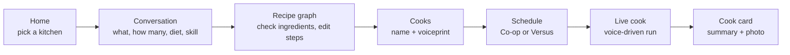
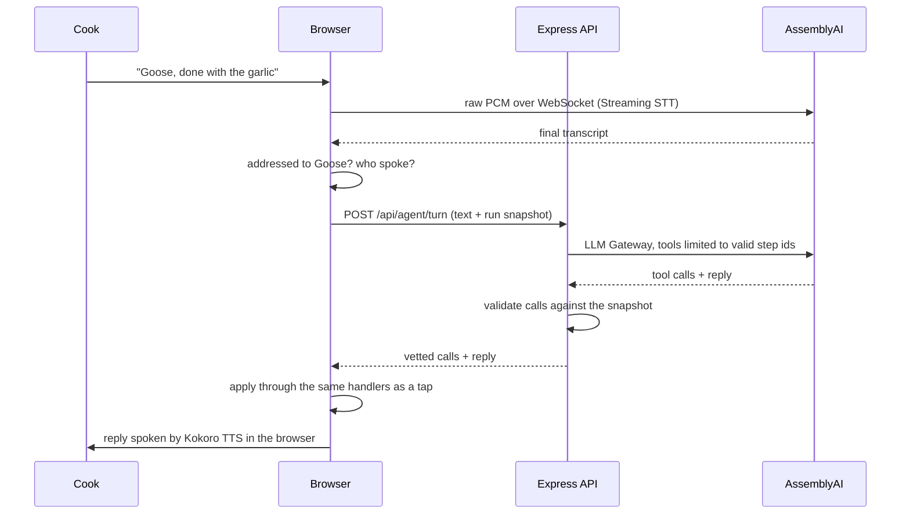

<h1 align="center">Goose! Goose! Cook!</h1>

<p align="center">
  
</p>

<p align="center">
  <b>A voice-run kitchen for two cooks and one very serious goose.</b><br>
  Tell Goose what you want for dinner. It drafts the recipe, splits the work, and calls the steps while you cook.
</p>

<p align="center">
  <a href="https://ziqing110.github.io/goose-goose-cook/">Live demo</a> ·
  <a href="docs/API_FLOW.md">API flow</a> ·
  <a href="docs/VOICE_COMMANDS.md">Voice commands</a> ·
  <a href="DEPLOY.md">Deploy</a>
</p>

---

## The pitch

Cooking a multi-dish dinner with someone else is a scheduling problem that
nobody treats as one. Two people, one stove, three dishes, and a rice cooker
that needs starting before anything else. Somebody ends up idle while the
other is juggling four pans.

Goose! Goose! Cook! treats a recipe as a **graph of steps** and your kitchen
as a set of **limited resources**. It works out the fastest plan for the
cooks and equipment you actually have, then runs that plan live, by voice,
so nobody has to touch a screen with wet hands.

- **Talk, don't type.** Streaming speech-to-text runs through the whole app.
  Say "Goose, I'm done with the onion" and the plan moves on.
- **Real scheduling.** A branch-and-bound scheduler finds the shortest
  finish time against burners, woks, pots and people, then balances the work
  so one cook isn't doing three times as much.
- **Two ways to play.** *Co-op* follows the plan together. *Versus* opens a
  pool of steps that cooks claim and score on.
- **An agent that can't go rogue.** The model only proposes actions. The
  server checks every one against the live run before the page applies it.
- **A keepsake at the end.** Each cook ends with a summary card: photo,
  stats, and a few lines from Goose about how it went.

## How it works

A session walks through five stages. Every page listens to the same mic.



| Stage | What happens | Where it lives |
|---|---|---|
| Home | Pick or create a kitchen (its equipment is the resource limit), resume a run, see past cooks | `src/pages/HomePage.jsx` |
| Conversation | Goose asks four questions. Each spoken answer is read by an LLM into a structured slot | `ConversationPage.jsx`, `server/routes/understanding.js` |
| Recipe graph | An LLM drafts one step graph per dish, a second model reviews it, and shared prep (like mincing garlic) is merged across dishes. You uncheck what you're out of and see which steps it blocks | `InventoryPage.jsx`, `server/routes/recipes.js`, `reviewPlan.js` |
| Cooks | Each cook reads a line aloud. Optionally, a local service stores a voiceprint so Goose knows who spoke | `VoiceBindingPage.jsx`, `speaker-sidecar/` |
| Schedule | The scheduler builds a two-lane timeline with the critical path, or the Versus opening hand | `SchedulePage.jsx`, `src/utils/scheduleLayout.js` |
| Live cook | Cooks start, finish and hand off steps by voice or tap. Goose re-plans on every change | `LiveCookPage.jsx`, `src/utils/liveCook.js`, `server/agent/` |
| Cook card | A frozen record of the run, downloadable as a PNG | `CookSummaryPage.jsx`, `src/utils/summaryCard.js` |

### One live-cook turn



If the agent is slow or unreachable, a local keyword grammar
(`src/utils/voiceCommands.js`) handles the command offline. If a question
needs a lookup ("can I use a shallot?"), the answer is fetched in the
background so the cook isn't blocked.

## Tech stack

| Layer | Tools |
|---|---|
| Frontend | React 18, Vite 5, React Router 6, plain CSS with design tokens |
| Backend | Node 24, Express 5, SQLite via `better-sqlite3` |
| Speech in | AssemblyAI Streaming STT (`universal-3-5-pro`), browser connects directly with a short-lived token |
| LLMs | AssemblyAI LLM Gateway: Claude Sonnet 4.6 (reading answers, reviewing plans, cook summary), Gemini 3.8 Flash (recipe graphs), GPT-4.1 (live agent with tools), Gemini 2.5 Flash Lite (small talk) |
| Speech out | Kokoro-82M on WebGPU through `kokoro-js`, runs in the browser. Falls back to Web Speech |
| Web lookup | Tavily (optional) |
| Speaker ID | NVIDIA NeMo TitaNet in a local Python sidecar (optional, never deployed) |
| Testing | `node:test` for pure logic, Playwright for end-to-end runs |
| Hosting | GitHub Pages (static app) + Render (API) |

Every model choice was benchmarked, not picked by name. The numbers and
reasoning are in [.env.example](.env.example) and `recipe-bench/`.

## Getting started

**You need:** Node 24 (Node 22 minimum), an
[AssemblyAI API key](https://www.assemblyai.com/dashboard/api-keys), and
Chrome or Edge for the mic and WebGPU.

```bash
git clone https://github.com/Ziqing110/goose-goose-cook.git
cd goose-goose-cook
npm install
cp .env.example .env        # then set ASSEMBLYAI_API_KEY
npm run dev:full
```

Open <http://localhost:5173> and allow the microphone. The API runs on
port 3001, and Vite proxies `/api/*` to it.

The SQLite database (`server/data.sqlite`) is created and seeded on first
run with a demo kitchen, dish templates and a materials catalog. Delete it
any time to start clean.

> [!NOTE]
> On Windows, `npm install` may need the C++ build tools because
> `better-sqlite3` is a native module.

> [!IMPORTANT]
> The API key stays on the server. The browser only ever receives
> short-lived tokens from `/api/voice/stt-token`.

### Environment

Only `ASSEMBLYAI_API_KEY` is required. The rest have working defaults.

| Variable | Default | Purpose |
|---|---|---|
| `ASSEMBLYAI_API_KEY` | none | Streaming STT and every LLM call |
| `AAI_AGENT_MODEL` | `gpt-4.1` | Live-cook agent. Must support tools |
| `AAI_RECIPE_MODEL` | `gemini-3.8-flash` | Recipe graph generation |
| `AAI_RECIPE_REVIEW_MODEL` | `claude-sonnet-4-6` | Second-pass plan review (`AAI_RECIPE_REVIEW=off` skips it) |
| `TAVILY_API_KEY` | empty | Enables mid-cook web lookups |
| `ALLOWED_ORIGINS` | empty (allow all) | CORS for the deployed API |

A free-tier AssemblyAI account may not have access to every model. If you
see a "no access" error, pick another model listed in `.env.example`.

### Scripts

| Command | What it does |
|---|---|
| `npm run dev:full` | Frontend and API together |
| `npm run dev:voice` | Frontend, API and the speaker sidecar |
| `npm run dev` / `npm run server` | Frontend or API alone |
| `npm test` | Unit tests |
| `npm run test:e2e` | Playwright run through a live cook |
| `npm run agent:calibrate` | Score the agent against a table of utterances (`-- --models a,b` to compare) |
| `npm run tts-lab` | Voice bench at <http://localhost:3101> |
| `npm run build` | Production build into `dist/` |

### Speaker identification (optional)

With one mic and two cooks, a local service can tell who is speaking by
matching each turn against the voiceprint recorded on the Cooks page.
Voiceprints stay on your machine in `speaker-sidecar/voiceprints.json`
(gitignored). Without the service, the live cook uses a speaker toggle
instead.

```bash
npm run speaker   # http://127.0.0.1:3103
```

It needs a Python 3.13 environment at `.venv-voice` with CUDA PyTorch,
NVIDIA NeMo, `soundfile`, `soxr` and `librosa`. The TitaNet model downloads
on first use. Set `SPEAKER_DEVICE=cpu` to skip the GPU.

The app only calls the service when `VITE_SPEAKER_SERVICE=on` is set in
`.env`. It is off by default and always off in the deployed demo.

## Project structure

```
server/
  index.js              Express entry, mounts every /api router
  db.js                 SQLite schema and demo seed
  routes/               kitchens, sessions, recipes, reviewPlan,
                        understanding, voice (token minting), agent, photo
  agent/                live-cook brain: turn validation, gateway call,
                        web search, background answers, asides, summaries
src/
  pages/                one page per stage (Home through Cook card)
  components/           shared UI: VoiceBar, RecipeBoard, GooseVoiceAgent...
  state/                app store (React context + reducer), synced to the API
  hooks/                useStreamingTranscript (mic to AssemblyAI)
  voice/                agent voice (Kokoro), audio taps, speaker selection
  utils/                pure logic with tests: scheduler, run state machine,
                        graph layout, voice grammars, scoring
  styles/tokens.css     design tokens, light and dark
speaker-sidecar/        optional Python TitaNet service
scripts/                e2e runs, seeding, evaluation, asset builds
docs/                   API flow, voice commands, test plans
```

Pure logic lives in `src/utils/` with no DOM or React imports, so the
scheduler and run state machine are tested without mounting a page. The
browser owns the live run. Each agent request carries a snapshot of it, so
the server stays stateless.

## Further reading

- [docs/API_FLOW.md](docs/API_FLOW.md): every external call and what triggers it
- [docs/VOICE_COMMANDS.md](docs/VOICE_COMMANDS.md): what you can say on each page
